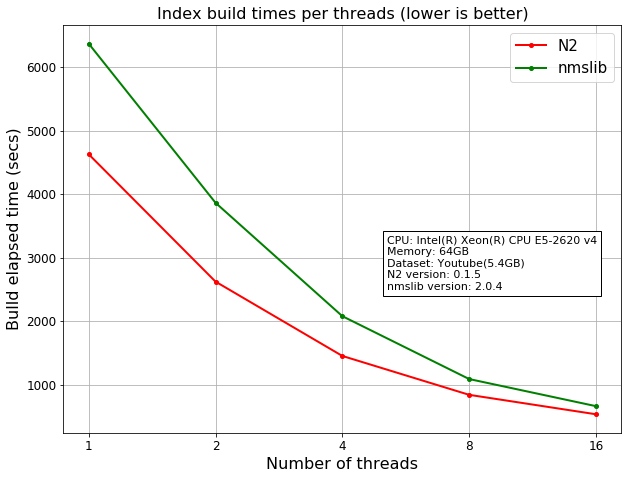

# N2 Benchmark explanation

## Benchmark Focus
First, the new approximate nearest neighborhoods algorithm should run faster for large datasets.
Second, online content services like news portal, where dataset is frequently updated(e.g. create/update/delete), building the index file should be done in minimum time.
Therefore, these are our main criteria:

* How long does it take to build the index file?
* How long does it take to get results from the large dataset?
* How large memory does it take to run large dataset?

## Test dataset
### Dataset description

The dataset consists of two files. `youtube.txt` contains 14520986 samples, each sample has 40 data points. 

| feature1(float32) | feature2(float32) | ...... | feature2(float32) | feature40(float32) |
|:-----------------:|:-----------------:|:------:|-------------------|--------------------|

`youtube.txt.vids` is a metadata informations of the dataset. Each line is the metadata  corresponding to each sample of `youtube.txt`.

| DSID | VID | Youtube link |
|:----:|-----|--------------|

### How to get it
We share our dataset through [google drive](https://drive.google.com/open?id=1B3PWRTb8xol9fEkawVbpfitOsuwXkqss).

## Index build times

Generally N2 is faster than the nmslib to build index file. Compared to the annoy, N2 begins to show the similar performance of the annoy when N2 uses 5 threads, and from then on it shows a faster build performance than the annoy. 

|     Library    |      1 thread      |     5 threads     |     10 threads    |     20 threads    |
|:--------------:|:------------------:|:-----------------:|:-----------------:|:-----------------:|
|   N2 (3.1Gb)   | 4505.36695409 sec  | 1002.47510505 sec | 591.641959906 sec | 478.121060133 sec |
| nmslib (3.4Gb) |  7130.72025204 sec | 1453.57017207 sec | 826.915107012 sec | 602.120007992 sec |
| annoy (4.4Gb)  |  915.411074877 sec | 915.411074877 sec | 915.411074877 sec | 915.411074877 sec |

## Search speed

|                 Library                 |      Search time      | Accuracy |
|:---------------------------------------:|:---------------------:|:--------:|
|     Linear search (numpy based)         |   0.358749273825 sec  | 1.0      |
|     N2 (efCon = 100, efSearch = 10)     | 2.98758983612e-05 sec | 0.054243 |
|     N2 (efCon = 100, efSearch = 100)    | 0.000128486037254 sec |  0.48313 |
|    N2 (efCon = 100, efSearch = 1000)    | 0.000824773144722 sec | 0.840634 |
|    N2 (efCon = 100, efSearch = 10000)   |  0.00720949418545 sec | 0.926739 |
|   N2 (efCon = 100, efSearch = 100000)   |  0.0763142487288 sec  | 0.940606 |
|   Nmslib (efCon = 100, efSearch = 10)   |  9.8201584816e-05 sec | 0.226192 |
|   Nmslib (efCon = 100, efSearch = 100)  | 0.000225761222839 sec | 0.672228 |
|  Nmslib (efCon = 100, efSearch = 1000)  |  0.00140970699787 sec | 0.882695 |
|  Nmslib (efCon = 100, efSearch = 10000) |  0.0143689704418 sec  | 0.935395 |
| Nmslib (efCon = 100, efSearch = 100000) |   0.159999159241 sec  |  0.94283 |
|      Annoy(n_trees=10, search_k=7)      | 4.04834747314e-05 sec |  0.05471 |
|     Annoy(n_trees=10, search_k=3000)    |  0.00096510682106 sec | 0.481099 |
|    Annoy(n_trees=10, search_k=50000)    |  0.0144059297085 sec  | 0.835895 |
|    Annoy(n_trees=10, search_k=200000)   |   0.053891249156 sec  | 0.918569 |
|    Annoy(n_trees=10, search_k=500000)   |   0.108285815144 sec  | 0.940851 |

Overall, we can see that N2 has a much higher accuracy than the annoy, and N2 has better performance than the other two libraries at high precision points.

## Memory usage

| Library | Peak memory usage | Search time peak memory usage |
|:-------:|:-----------------:|:-----------------------------:|
|    N2   |    5360.93750Mb   |          3441.13281Mb         |
|  annoy  |    5360.89844Mb   |          3441.09375Mb         |
|  nmslib |    5360.97656Mb   |         3441.17188 Mb         |

The three libraries do not show much difference in memory usage.

## Conclusion
This is a summary of a benchmark.

In terms of indexing performance, N2 will perform better than others on multi-core CPUs machine. The annoy is also good a choice especially for small datasets that can be handled well by a single thread. But as you can see the experimental results, N2 will be a better choice if the dataset is large and fast indexing speed is needed. In fact, indexing performance is not critical in most cases where the dataset is small.

If you need high precision, the nmslib and N2, which use the hnsw algorithm, are the best choice. In the experiments, N2 shows almost 2x faster than the annoy.
